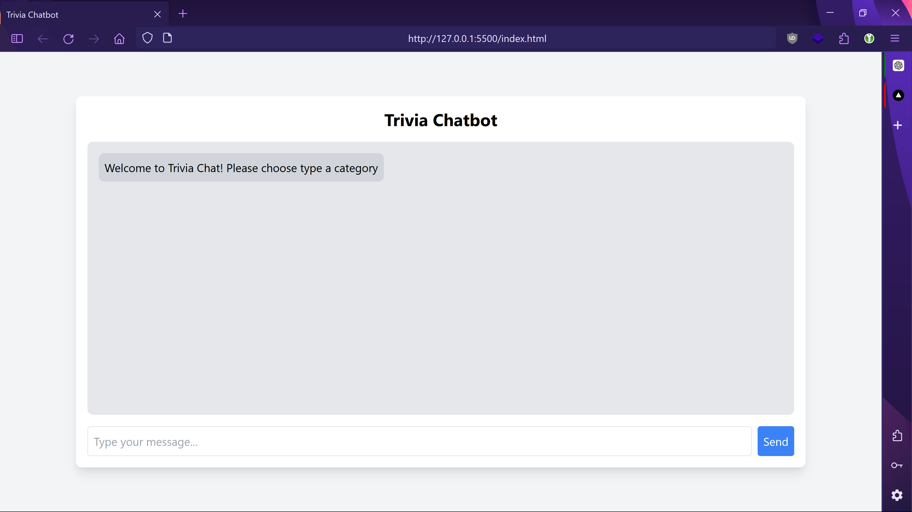

# Trivia Chatbot

Triva Chatbot on the browser

## Requirements
- Python 3.12
- Git
- IDE pycharm / vscode (python extension must be installed)
- Browser

## Setup

- Clone the project

```bash
git clone https://github.com/se7enseads/Trivia.git && cd Trivia
```
- Run the command below to setup the dependencies in a python environment(run):

```bash
python -m venv env
.\env\Scripts\activate
```
- Refresh the terminal then run the command below

```bash
pip install -r requirements.txt
```

## Run the app

To run the app, first run the server then the client:

```bash
python app.py
```

Then open the index.html file in the browser.


## Chatbot Tutorial

On the browser in put your desired category, then the difficulty and then the number of questions.

Anser the question by inputting the number corresponding to your answer.


Once complete the chatbot will give you your score